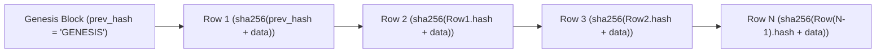

# Security, DPDP Act 2023 Compliance & Threat Modeling

**Document:** `docs/api/security.md`  
**Author:** Lane D (Backend Contract & Architecture)  
**Status:** Settled  
**Compliance Target:** Digital Personal Data Protection Act (DPDP) 2023, ABDM Security & Privacy Guidelines

---

## 1. Granular Role-Based Access Control (RBAC) Matrix

Permissions Legend:
- `ALLOW`: Unrestricted role access
- `OWN`: Restricted to authenticated citizen's registered patient profiles (`sub.patientIds`)
- `FAC`: Strictly scoped to the authenticated staff member's physical facility (`sub.facilityId`)
- `CG`: Consent-Gated; requires an active time-boxed `consent_grant` or active clinical encounter
- `DENY`: Explicitly forbidden (HTTP `403 Forbidden`)

| Endpoint Path | Method | `CITIZEN` | `DOCTOR` | `PHARMACIST` | `FACILITY_ADMIN` | `DISTRICT_ADMIN` | `STATE_ADMIN` |
|---|---|---|---|---|---|---|---|
| `/auth/otp/request` | `POST` | `ALLOW` | `ALLOW` | `ALLOW` | `ALLOW` | `ALLOW` | `ALLOW` |
| `/auth/otp/verify` | `POST` | `ALLOW` | `ALLOW` | `ALLOW` | `ALLOW` | `ALLOW` | `ALLOW` |
| `/auth/me` | `GET` | `ALLOW` | `ALLOW` | `ALLOW` | `ALLOW` | `ALLOW` | `ALLOW` |
| `/auth/abha/link` | `POST` | `OWN` | `DENY` | `DENY` | `DENY` | `DENY` | `DENY` |
| `/patients` | `GET` | `OWN` | `DENY` | `DENY` | `DENY` | `DENY` | `DENY` |
| `/patients` | `POST` | `OWN` | `DENY` | `DENY` | `DENY` | `DENY` | `DENY` |
| `/patients/{id}` | `GET` | `OWN` | `CG` | `DENY` | `DENY` | `DENY` | `DENY` |
| `/facilities` | `GET` | `ALLOW` | `ALLOW` | `ALLOW` | `ALLOW` | `ALLOW` | `ALLOW` |
| `/facilities/{id}/slots`| `GET` | `ALLOW` | `ALLOW` | `ALLOW` | `ALLOW` | `ALLOW` | `ALLOW` |
| `/appointments` | `POST` | `OWN` | `DENY` | `DENY` | `FAC` | `DENY` | `DENY` |
| `/appointments/{id}/check-in` | `POST` | `OWN` | `DENY` | `DENY` | `FAC` | `DENY` | `DENY` |
| `/queues/{f}/{d}/state` | `GET` | `ALLOW` | `ALLOW` | `ALLOW` | `ALLOW` | `ALLOW` | `ALLOW` |
| `/queues/{f}/{d}/entries` | `GET` | `DENY` | `FAC` | `DENY` | `FAC` | `DENY` | `DENY` |
| `/queues/{f}/{d}/call-next` | `POST`| `DENY` | `FAC` | `DENY` | `DENY` | `DENY` | `DENY` |
| `/triage/evaluate` | `POST` | `ALLOW` | `ALLOW` | `DENY` | `DENY` | `DENY` | `DENY` |
| `/patients/{id}/records`| `GET` | `OWN` | `CG` | `DENY` | `DENY` | `DENY` | `DENY` |
| `/records` | `POST` | `DENY` | `FAC` | `DENY` | `DENY` | `DENY` | `DENY` |
| `/records/break-glass` | `POST` | `DENY` | `FAC` | `DENY` | `DENY` | `DENY` | `DENY` |
| `/prescriptions` | `POST` | `DENY` | `FAC` | `DENY` | `DENY` | `DENY` | `DENY` |
| `/prescriptions/{id}/dispense`| `POST`| `DENY` | `DENY` | `FAC` | `DENY` | `DENY` | `DENY` |
| `/facilities/{id}/stock`| `GET` | `ALLOW` | `ALLOW` | `ALLOW` | `ALLOW` | `ALLOW` | `ALLOW` |
| `/facilities/{id}/stock/adjust`| `POST`| `DENY` | `DENY` | `FAC` | `FAC` | `DENY` | `DENY` |
| `/complaints` | `POST` | `OWN` | `DENY` | `DENY` | `DENY` | `DENY` | `DENY` |
| `/complaints/{id}/updates` | `POST`| `DENY` | `DENY` | `DENY` | `FAC` | `ALLOW` | `DENY` |
| `/analytics/facilities/{id}`| `GET` | `DENY` | `DENY` | `DENY` | `FAC` | `ALLOW` | `ALLOW` |
| `/audit/verify` | `GET` | `DENY` | `DENY` | `DENY` | `FAC` | `ALLOW` | `ALLOW` |

---

## 2. Consent-Gated Clinical Reads & Break-Glass Emergency Protocol

### Standard Consent Flow
1. Patient health records are confidential digital personal health data.
2. A doctor cannot read a patient's historical records unless:
   - **Condition A:** An active, checked-in appointment exists for that patient at the doctor's facility today, OR
   - **Condition B:** A valid `consent_grant` exists (`valid_from <= NOW() <= valid_until` AND `revoked_at IS NULL`).
3. Every record access (read) writes an entry to `audit_log` with the doctor's `user_id`, `patient_id`, timestamp, and client IP.

### Break-Glass Emergency Protocol
In trauma, acute shock, or unconscious patient presentations, obtaining electronic consent is physically impossible. Blocking clinical care is catastrophic.
- **Trigger:** Doctor calls `POST /api/v1/records/break-glass`.
- **Requirements:**
  - Mandatory clinical justification text (`reason`) with a minimum length of 20 characters (e.g., *"Unconscious road traffic accident victim, severe head trauma, unable to provide consent"*).
  - Explicit physical `encounter_id` and `facility_id`.
- **System Actions:**
  - Issues a 4-hour temporary access token scoped strictly to that patient.
  - Generates a **High-Severity Audit Log Entry** in `audit_log` with `action = 'break_glass'`.
  - Dispatches immediate SMS alerts to the patient's registered mobile number and the Facility Medical Superintendent.
  - Automatically flags the encounter for mandatory retrospective clinical review at the weekly hospital board audit.

---

## 3. Cryptographic Audit Log & Immutability Architecture

### Three Layers of Immutability Defense
1. **Cryptographic Hash Chain:**
   Each row records the SHA-256 digest of the previous row plus its own canonical fields:
   $$\text{row\_hash} = \text{SHA256}(\text{prev\_hash} \,\|\, \text{id} \,\|\, \text{action} \,\|\, \text{actor\_user\_id} \,\|\, \text{target\_entity\_type} \,\|\, \text{target\_entity\_id} \,\|\, \text{occurred\_at})$$
   Modifying or deleting any historical row invalidates all subsequent row hashes across the entire table.
2. **PostgreSQL Trigger Hard Lock:**
   A `BEFORE UPDATE OR DELETE` database trigger raises an immediate exception (`CANNOT_MODIFY_AUDIT_LOG`), blocking even superusers from modifying records via the ORM.
3. **Database Role Privilege Separation:**
   The application service connects via role `app_user` which is granted strictly `SELECT, INSERT` privileges. `UPDATE` and `DELETE` permissions are revoked at the schema level.

---

## 4. Aadhaar & ABHA Security Posture

### Why Raw Aadhaar is Never Stored
Under Section 29 of the Aadhaar Act 2016 and UIDAI circulars, storing raw 12-digit Aadhaar numbers without AUA/KUA certification and a dedicated Hardware Security Module (HSM) is illegal:
- **No Plaintext Aadhaar:** The database structurally contains no column capable of storing 12 digits.
- **HMAC-SHA256 vs Plain SHA-256:**
  - Aadhaar numbers comprise a narrow space ($10^{12}$ possibilities).
  - A fast unsalted or fixed-salt SHA-256 hash can be reversed across all 1 trillion possibilities in $< 3$ days using modern GPU clusters.
  - Swasthya mandates **HMAC-SHA256** using an isolated secret key (pepper) stored outside the database in an HSM / secrets vault.
- **Display Last 4 Only:** Applications only display `aadhaarLast4` (e.g. `**** **** 4321`) for visual identity verification.
- **ABDM Mock Gateway Adapter:** All ABDM interactions sit behind an adapter interface; no external credentials or live government gateway keys are hardcoded in the codebase.

---

## 5. Digital Personal Data Protection (DPDP) Act 2023 Compliance Checklist

| DPDP Section | Statutory Principle | Swasthya Platform Implementation | Official Statutory Reference |
|---|---|---|---|
| **Sec 6(1)** | Consent Specification | Patients grant granular, time-boxed consent specifying purpose and duration via `consent_grants`. | [DPDP Act 2023 Gazette](https://www.meity.gov.in/content/digital-personal-data-protection-act-2023) |
| **Sec 6(7)** | Right to Revoke | Citizens can withdraw consent at any time via `POST /api/v1/consent/grants/{id}/revoke`. | [DPDP Act 2023](https://www.meity.gov.in/content/digital-personal-data-protection-act-2023) |
| **Sec 7** | Legitimate Uses (Emergency) | Emergency break-glass access is legally compliant with emergency medical treatment provisions. | [DPDP Act 2023 Sec 7(b)](https://www.meity.gov.in/content/digital-personal-data-protection-act-2023) |
| **Sec 8(5)** | Purpose Limitation & Erasure | Clinical records are append-only by medical law; analytical event stores use pseudonymous identifiers. Patient erasure shreds the encryption key linking citizen account to clinical pseudonyms. | [DPDP Act 2023 Sec 8(5)](https://www.meity.gov.in/content/digital-personal-data-protection-act-2023) |
| **Sec 8(6)** | Breach Notification | Any unauthorized access triggers automated alerts to the Data Protection Officer (DPO) and CERT-In within 72 hours. | [CERT-In Cyber Security Directions 2022](https://www.cert-in.org.in/) |
| **Sec 9** | Children's Data Protection | Dependents under 18 cannot be self-registered; they are linked to a verified adult guardian account (`1:N` model). | [DPDP Act 2023 Sec 9](https://www.meity.gov.in/content/digital-personal-data-protection-act-2023) |

---

## 6. Threat Modeling: Top 10 Threats & Architectural Controls

| # | Threat Vector | Real-World Attack Scenario | Swasthya Architectural Control |
|---|---|---|---|
| **1** | **Insecure Direct Object Reference (IDOR)** | Malicious patient alters URL from `/patients/pat_01/records` to `/patients/pat_02/records`. | Application middleware validates path parameter against `patientIds` array embedded in the cryptographically signed JWT. Returns `403 Forbidden`. |
| **2** | **Client-Supplied Facility Spoofing** | Attendant at PHC sends `facilityId: "fac_district_hospital"` in POST body to claim higher privileges. | Request bodies ignore client `facilityId`. The server derives `facilityId` solely from the authenticated staff user's active `staff_postings` JWT claim. |
| **3** | **OTP Brute-Force & Flooding** | Attacker attempts to guess 6-digit OTPs or exhausts SMS gateway budget. | Strict Redis sliding-window rate limiting: max 3 OTP requests per phone per 15 minutes; max 5 verification attempts per session before session revocation. |
| **4** | **Token Theft on Shared Family Phones** | Family members sharing one Android phone access each other's sensitive health histories. | Active Patient profile context must be explicitly selected on-screen; sensitive records require secondary PIN or biometric unlock. |
| **5** | **Race Condition Overbooking** | 100 bots concurrently attempt to book the last available OPD slot. | Pessimistic row lock (`SELECT ... FOR UPDATE`) on the `slots` record serializes requests; 51st request receives `409 Conflict: SLOT_FULL`. |
| **6** | **Pharmacy Inventory Tampering** | Pharmacist adjusts medicine quantities to cover diversion/theft without record. | Every stock movement requires an append-only row in `stock_ledger` with unique `idempotency_key` and actor user ID. Direct manual balance updates are disallowed. |
| **7** | **Audit Log Truncation / Modification** | Rogue database administrator attempts to erase an audit entry covering illicit record access. | SHA-256 hash-chain verification immediately fails (`verify_audit_chain()` returns `false`); trigger prevents `UPDATE` and `DELETE`. |
| **8** | **Cross-Facility Doctor Snooping** | Doctor at Facility A browses medical records of patients admitted at Facility B. | Multi-tenant RBAC verifies doctor has an active appointment or referral for that patient at Facility A today. |
| **9** | **Replay Attack on Financial / Drug Dispense** | Intermittent mobile connection causes pharmacist client to re-submit stock dispense request 3 times. | Mutating endpoints require `Idempotency-Key` UUID header. Subsequent requests match existing ledger key and return cached `200 OK` without double deduction. |
| **10**| **AI Triage Hallucination of Definitive Diagnosis** | Patient enters "crushing chest pain" and engine returns a definitive diagnosis like "Myocardial Infarction", causing panic and medical liability. | Triage engine structurally contains zero free-text clinical fields; returns strictly urgency band (1–5) and department routing code (`GEN_MED`), never a disease diagnosis. |
