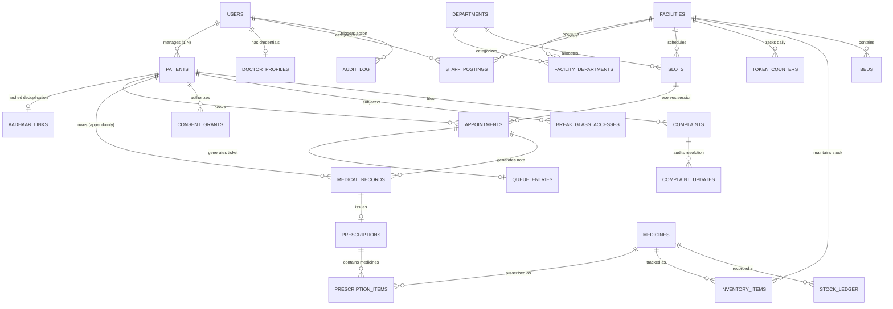

# Entity Relationship Diagram & Endpoint Data Mapping

**Document:** `docs/erd.md`  
**Author:** Lane D (Backend Contract & Architecture)  
**Status:** Settled  
**Database Engine:** PostgreSQL 16 (Relational + pgvector + pgcrypto)

---

## 1. Mermaid Entity-Relationship Diagram

---

## 2. Table to Module to Endpoint Cross-Reference Matrix

| Database Table | Primary Module | Endpoints That Read It | Endpoints That Write It |
|---|---|---|---|
| `users` | Auth & Identity | `GET /auth/me` | `POST /auth/otp/verify`, `POST /auth/logout` |
| `patients` | Patients | `GET /patients`, `GET /patients/{id}` | `POST /patients`, `PUT /patients/{id}` |
| `aadhaar_links` | Auth & DPDP | `POST /auth/abha/link` (lookup) | `POST /auth/abha/link` |
| `facilities` | Facilities | `GET /facilities`, `GET /facilities/{id}` | System seed / Admin management |
| `departments` | Facilities | `GET /facilities/{id}/departments` | System seed |
| `facility_departments` | Facilities | `GET /facilities/{id}/departments` | Admin configuration |
| `doctor_profiles` | Staff | `GET /facilities/{id}` | Admin management |
| `staff_postings` | Staff & RBAC | Internal RBAC token validator | Admin duty assignment |
| `slots` | Slots & Booking | `GET /facilities/{id}/slots` | `POST /appointments` (increments `booked_count` under `FOR UPDATE`) |
| `token_counters` | Queue Management | `GET /queues/{fac}/{dept}/state` | `POST /queues/{fac}/{dept}/call-next`, `POST /appointments` (atomic upsert) |
| `appointments` | Appointments | `GET /appointments/{id}` | `POST /appointments`, `POST /appointments/{id}/check-in`, `POST /appointments/{id}/cancel` |
| `queue_entries` | Queue Management | `GET /queues/{fac}/{dept}/entries` | `POST /queues/{fac}/{dept}/call-next`, `POST /queues/{fac}/{dept}/walk-in`, `POST /queues/{fac}/{dept}/skip` |
| `medical_records` | Health Records | `GET /patients/{id}/records`, `GET /records/{id}` | `POST /records` (strictly append-only) |
| `prescriptions` | Prescriptions | `GET /patients/{id}/prescriptions` | `POST /prescriptions`, `POST /prescriptions/{id}/dispense` |
| `prescription_items` | Prescriptions | `GET /patients/{id}/prescriptions` | `POST /prescriptions` |
| `medicines` | Inventory | `GET /medicines/search` | Seed data / Drug regulatory updates |
| `inventory_items` | Inventory | `GET /facilities/{id}/stock` | `POST /facilities/{id}/stock/adjust`, `POST /prescriptions/{id}/dispense` (`FOR UPDATE`) |
| `stock_ledger` | Inventory | `GET /facilities/{id}/stock/ledger` | `POST /facilities/{id}/stock/adjust`, `POST /prescriptions/{id}/dispense` (append-only) |
| `consent_grants` | Consent & DPDP | Internal consent gate on record reads | `POST /consent/grants`, `POST /consent/grants/{id}/revoke` |
| `break_glass_accesses` | Emergency Overrides | `GET /audit/entries` | `POST /records/break-glass` |
| `complaints` | Grievance | `GET /complaints`, `GET /complaints/{id}` | `POST /complaints` |
| `complaint_updates` | Grievance | `GET /complaints/{id}` | `POST /complaints/{id}/updates` (append-only) |
| `beds` | Inpatient Facilities | `GET /facilities/{id}/beds` | `PUT /facilities/{id}/beds/{id}` (optimistic locking) |
| `teleconsult_sessions` | Teleconsult | `POST /teleconsult/sessions/{id}/token` | `POST /teleconsult/sessions`, `POST /teleconsult/sessions/{id}/end` |
| `diagnostic_orders` | Diagnostics | `GET /patients/{id}/diagnostics` | `POST /diagnostics/orders`, `POST /diagnostics/orders/{id}/results` |
| `follow_up_schedules` | Follow-ups | `GET /patients/{id}/follow-ups` | `POST /follow-ups`, `POST /follow-ups/{id}/respond` |
| `outbox` | Event Streaming | Background outbox publisher worker | All mutating endpoints in same SQL transaction |
| `processed_events` | Event Consumers | Asynchronous event worker | Outbox consumer workers (idempotency key) |
| `audit_log` | Audit & Compliance | `GET /audit/entries`, `GET /audit/verify` | All mutating operations, view record, and break-glass (append-only hash chain) |
