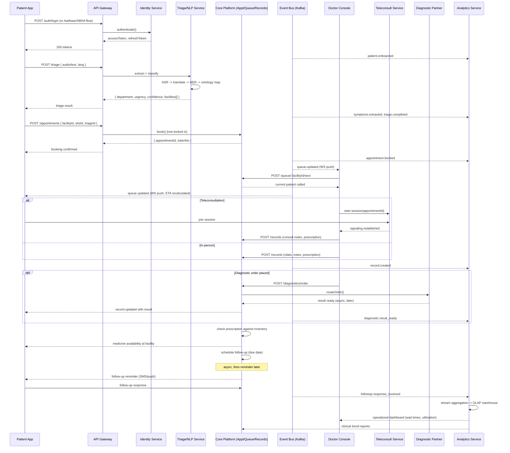

# Healthcare Platform — System Architecture & Pipeline Document

**Scope:** Patient Onboarding → Multilingual Triage → Doctor/Queue Workflow → Teleconsultation/Diagnostics → Follow-up → Analytics
**Audience:** Engineering team, technical reviewers
**Version:** 1.0

---

## 0. Executive Summary

This platform is architected as a **modular, event-driven system** — not a strict microservices mesh (too much operational overhead for the team size), and not a single monolith either (too coupled for a system with a real-time queue, an NLP pipeline, and video streaming living side by side). The pattern is a **modular monolith core + two horizontally-scaled services pulled out at the edges**: the Triage/NLP service (CPU/GPU-bound, benefits from independent scaling) and the Teleconsultation service (stateful WebRTC signaling, benefits from isolation). Everything else — Auth, Patient Records, Appointments, Queue, Complaints, Diagnostics, Follow-up, Analytics — lives in one well-modularized backend, communicating internally via function calls and externally via an event bus for anything another module needs to react to asynchronously.

The backbone of the whole system is a **message bus (Kafka)** carrying domain events (`patient.onboarded`, `triage.completed`, `queue.token.issued`, etc.). Synchronous REST/GraphQL APIs handle request/response work (booking a slot, fetching a record); the event bus handles everything that should happen *because* something else happened (analytics ingestion, follow-up scheduling, notification dispatch) without coupling those modules to each other's request paths.

---

## 1. High-Level System Architecture

```
┌─────────────────────────────────────────────────────────────────────────┐
│                          CLIENT LAYER                                    │
│   Patient App (Web/PWA)   Doctor Console   Admin Dashboard   IVR/SMS     │
└───────────────────────────────┬─────────────────────────────────────────┘
                                 │ HTTPS / WSS
                                 ▼
┌─────────────────────────────────────────────────────────────────────────┐
│                    API GATEWAY  (Kong / AWS API Gateway)                 │
│   TLS termination · authN passthrough · rate limiting · request routing  │
└───────┬─────────────┬─────────────┬─────────────┬───────────┬───────────┘
        ▼             ▼             ▼             ▼           ▼
  ┌──────────┐  ┌───────────┐ ┌───────────┐ ┌───────────┐ ┌─────────────┐
  │  IDENTITY │  │  CORE     │ │  TRIAGE/  │ │TELECONSULT│ │ ANALYTICS   │
  │  SERVICE  │  │  PLATFORM │ │  NLP      │ │  SERVICE  │ │  SERVICE    │
  │           │  │ (modular  │ │  SERVICE  │ │           │ │             │
  │ - login   │  │  monolith)│ │           │ │ WebRTC SFU│ │ Stream      │
  │ - Aadhaar │  │ - records │ │ - ASR     │ │ signaling │ │ processing  │
  │   /ABHA   │  │ - appts   │ │ - lang ID │ │ - chat    │ │ + warehouse │
  │ - JWT/OTP │  │ - queue   │ │ - NER     │ │ - session │ │             │
  │           │  │ - diag.   │ │ - ICD map │ │   notes   │ │             │
  │           │  │ - meds    │ │ - urgency │ │           │ │             │
  │           │  │ - complnt │ │   scoring │ │           │ │             │
  │           │  │ - followup│ │           │ │           │ │             │
  └─────┬─────┘  └─────┬─────┘ └─────┬─────┘ └─────┬─────┘ └──────┬──────┘
        │              │             │             │              │
        └──────────────┴──────┬──────┴─────────────┴──────────────┘
                               ▼
                 ┌───────────────────────────┐
                 │   EVENT BUS (Kafka)        │
                 │   domain events, async     │
                 │   fan-out to consumers     │
                 └──────────────┬─────────────┘
                                ▼
        ┌────────────────────────────────────────────────┐
        │                DATA LAYER (polyglot)             │
        │  PostgreSQL (transactional) · Redis (cache/queue) │
        │  Vector DB (symptom embeddings) · Object storage  │
        │  (reports/images) · OLAP warehouse (analytics)    │
        └────────────────────────────────────────────────┘
```

**Why this shape, not full microservices:** Auth, Records, Appointments, Queue, Diagnostics, Meds, Complaints, and Follow-up all share the same transactional core (a booking touches a slot, a queue entry, and eventually a record) — splitting them into separate services multiplies distributed-transaction complexity for no scaling benefit, since none of them are independently CPU-heavy. Triage/NLP and Teleconsultation *are* independently heavy (model inference; real-time media) and benefit from separate deploy/scale cycles — so those two are pulled out.

---

## 2. End-to-End Data Flow

```
Patient Onboarding/Auth
        │  (creates User + Patient identity, ABHA-linked)
        ▼
Multilingual Symptom Intake + Triage
        │  (raw speech/text → structured urgency + suggested department)
        ▼
Doctor Queue / Appointment Routing
        │  (triage output → facility/department → slot/token)
        ▼
Consultation: In-Person OR Teleconsultation
        │  (vitals, notes, prescription, diagnostic orders)
        ▼
Diagnostic Coordination (if ordered)
        │  (lab order → sample tracking → result → back to record)
        ▼
Medicine & Resource Fulfillment
        │  (prescription checked against pharmacy stock)
        ▼
Follow-up
        │  (recovery check-ins, reminders, re-triage if worsening)
        ▼
Analytics (continuous, fed by every stage above via events)
```

Every stage after Triage **emits an event** rather than directly calling the next stage's API where possible — this is what lets Analytics, Follow-up scheduling, and notification dispatch stay decoupled from the core request path (a slow analytics write should never make a booking request hang).

---

## 3. Per-Module Pipeline Design

### 3.1 Authentication & Identity Management

| Aspect | Details |
|---|---|
| **Input** | Phone number + password/OTP (standard flow); Aadhaar number + biometric/OTP consent (ABDM flow) |
| **Processing** | Standard: bcrypt/argon2 hash → JWT (short-lived access + rotating refresh). Aadhaar: never store the raw number — SHA-256(number + server-side pepper) for uniqueness, last 4 digits for display. ABDM flow additionally calls the **ABDM Gateway** to create/link an ABHA (Ayushman Bharat Health Account) ID, which becomes the patient's portable health identifier across facilities. |
| **Output** | `UserAuthenticated` event; access/refresh token pair; ABHA ID (if linked) |
| **DB (SQL — PostgreSQL)** | `users`, `refresh_tokens`, `aadhaar_links (hash, last4, abha_id)` — relational, strongly consistent, low write volume, needs ACID for account state |

### 3.2 Patient Records (EHR/EMR)

| Aspect | Details |
|---|---|
| **Input** | Consultation data from doctors (vitals, notes, prescriptions), diagnostic results, historical records on patient login |
| **Processing** | Append-only record creation; consent-gated reads (active appointment or time-boxed consent grant); every read logged for audit; optional **FHIR R4 resource mapping** (Patient, Encounter, Observation, MedicationRequest) if interoperating with ABDM Health Information Providers/Health Repositories |
| **Output** | `RecordCreated` event (triggers follow-up scheduling, analytics ingestion); FHIR bundle (for external HIP/HIQ exchange) |
| **DB (SQL)** | `medical_records`, `prescriptions`, `prescription_items`, `consent_grants`, `audit_log` — relational, records are legal artifacts, no eventual consistency tolerated here |

### 3.3 Multilingual Symptom-to-Disease Mapping (NLP Pipeline)

This is the module with the most architectural nuance — detailed below as its own pipeline.

```
Raw input (voice or text, any supported language)
        │
        ▼
[1] ASR (if voice)  ──  Sarvam STT / Whisper (Indic fine-tune)
        │
        ▼
[2] Language ID + Normalization  ──  script normalization, transliteration handling
        │
        ▼
[3] Machine Translation → pivot language (English)  ──  Sarvam Translate / NLLB
        │        (kept alongside original — never discard the source text)
        ▼
[4] Medical NER  ──  biomedical NER model (fine-tuned IndicBERT/mBERT, or
        │            structured LLM extraction) pulls out: symptom, duration,
        │            severity, body site, negation ("no fever" ≠ "fever")
        ▼
[5] Ontology Mapping  ──  extracted symptom phrases → embedding similarity
        │            search against a vector index of canonical symptom/
        │            condition terms, mapped to ICD-10 / SNOMED CT codes.
        │            This is retrieval, not generation — the model never
        │            invents a code; it ranks nearest known codes with a
        │            confidence score, and low-confidence matches fall back
        │            to a broader parent category.
        ▼
[6] Structured Output  ──  { symptoms[], codes[], confidence, language,
                             originalText, translatedText }
```

| Aspect | Details |
|---|---|
| **Input** | Free text or audio, any of the platform's supported languages |
| **Processing** | Steps 1–6 above. Confidence thresholds gate every stage — low-confidence NER or ontology matches degrade gracefully to a broader category rather than a wrong specific one. |
| **Output** | Structured symptom object feeding the Triage module; `SymptomsExtracted` event for analytics (disease trend surfacing) |
| **DB** | **Vector DB** (pgvector on Postgres, or a dedicated store like Weaviate/Qdrant) for the symptom/condition embedding index — this is a similarity-search workload, not a transactional one, so it's deliberately separated from the relational core. Extracted-symptom logs go to the OLAP warehouse for trend analysis. |

### 3.4 Triage System

| Aspect | Details |
|---|---|
| **Input** | Structured symptom output from 3.3, patient age/gender/location |
| **Processing** | **Deterministic red-flag rules run first and always** (pattern match on the extracted symptom codes for emergency presentations) — this is a hard architectural rule: emergency safety must never depend on model availability or correctness. If no red flag, an LLM/rules-hybrid scores urgency and suggests a department; output is schema-constrained so no field can hold a disease name — this is a routing system, not a diagnostic one. |
| **Output** | `{ department, urgency, confidence, recommendedFacilities[] }`; `TriageCompleted` event (drives queue/appointment routing and analytics) |
| **DB (SQL)** | `triage_sessions` — relational, needs joins to patient/facility for the ranking step |

### 3.5 Complaints & Tracking System

| Aspect | Details |
|---|---|
| **Input** | Free-text/voice grievance narrative, facility reference |
| **Processing** | Same NLP pipeline (3.3) reused for language handling; LLM structures the narrative into a formal complaint (category, severity, structured body) — citizen reviews/edits before submission; deterministic routing engine (not the LLM) assigns owner + SLA based on category/severity |
| **Output** | Ticket with immutable status-transition log; `ComplaintStatusChanged` events drive notifications and SLA-breach escalation |
| **DB (SQL)** | `complaints`, `complaint_updates` (append-only timeline) |

### 3.6 Appointments & Queue Management

| Aspect | Details |
|---|---|
| **Input** | Triage output (or direct booking), facility/department/slot selection |
| **Processing** | Slot booking is a **row-locked transaction** (`SELECT ... FOR UPDATE`) to prevent overbooking under concurrency; token allocation is sequential per facility/department/day. Queue state transitions (call-next/skip/recall) are also transactional and broadcast over WebSocket. |
| **Output** | `AppointmentBooked`, `QueueUpdated` events; real-time push to connected clients |
| **DB (SQL)** | `appointments`, `slots`, `queue_entries` — strict consistency required (shared capacity resource); **Redis** used for the ephemeral "who's currently connected/subscribed" socket-room state, never as the source of truth for queue position |

### 3.7 Teleconsultation

| Aspect | Details |
|---|---|
| **Input** | Confirmed appointment, patient + doctor join request |
| **Processing** | WebRTC session via an **SFU (Selective Forwarding Unit)** — e.g., mediasoup, LiveKit, or Jitsi's SFU — signaling handled by a dedicated service (isolated from the core API for blast-radius reasons: a media outage should never take down booking/queue). Session chat and real-time consultation notes flow through the same signaling channel; notes are persisted as a draft `MedicalRecord` that the doctor finalizes. |
| **Output** | Session recording metadata (not raw video, for storage cost — recording itself in object storage if legally required and consented to), finalized consultation record |
| **DB** | Session metadata in **PostgreSQL**; if recordings are retained, files go to **object storage** (S3-compatible) with signed, time-limited access URLs — never public buckets for anything patient-identifiable |

### 3.8 Diagnostic Coordination

| Aspect | Details |
|---|---|
| **Input** | Lab test order from a consultation |
| **Processing** | Order created → routed to lab/diagnostic partner (internal or external, via a standard interface — ideally FHIR `ServiceRequest`/`DiagnosticReport`) → sample tracked through fixed states (ordered → collected → in-lab → resulted) → result ingested and attached back to the patient's record |
| **Output** | `DiagnosticOrdered`, `DiagnosticResultReady` events (the latter can trigger a follow-up nudge or doctor notification) |
| **DB (SQL)** | `diagnostic_orders`, `diagnostic_results` — results as structured values where possible (numeric ranges) plus attached report files in object storage |

### 3.9 Patient Follow-up

| Aspect | Details |
|---|---|
| **Input** | `RecordCreated` / `DiagnosticResultReady` events, doctor-set follow-up date |
| **Processing** | A scheduler (cron-like job or a delayed-message pattern in the queue, e.g. Kafka message with a future-timestamp check, or a dedicated scheduler like a `pg_cron` job) fires reminders (SMS/push/notification) at the follow-up date; patient-reported recovery status is captured and can trigger re-triage if worsening |
| **Output** | `FollowUpReminderSent`, `FollowUpResponseReceived` events |
| **DB (SQL)** | `follow_ups` (patient, record ref, due date, status, response) |

### 3.10 Medicine & Resources Availability

| Aspect | Details |
|---|---|
| **Input** | Pharmacist stock adjustments, bed status updates, equipment status |
| **Processing** | **Ledger-based, never absolute overwrite** — every change is a delta with an idempotency key, current quantity is a derived projection (`SUM(deltas)`), which makes offline sync and concurrent updates safe. Bed/equipment status is simpler state (available/occupied/out-of-service) but still versioned to avoid lost updates. |
| **Output** | `StockUpdated`, `BedStatusChanged` events (feed prescription-time stock checks and citizen-facing availability search) |
| **DB (SQL)** | `inventory_items`, `stock_ledger` (append-only), `beds`, `equipment` |

### 3.11 System-Wide Analytics

| Aspect | Details |
|---|---|
| **Input** | Every domain event on the bus: onboarding, triage, appointments, queue transitions, teleconsult sessions, diagnostics, stock changes, complaints, follow-ups |
| **Processing** | Stream consumers (Kafka Streams / a lightweight consumer service) aggregate events into an **OLAP warehouse** (ClickHouse, or Postgres with a star-schema + materialized views if scale doesn't yet justify a separate warehouse). Two distinct consumer tracks: **Operational metrics** (queue wait times, doctor utilization, no-show rate — near-real-time, dashboarded) and **Clinical insights** (disease/symptom trend analysis over the anonymized/aggregated triage+diagnostic data — batch, privacy-reviewed before any external reporting). |
| **Output** | Dashboards (Grafana/Metabase/custom), scheduled trend reports |
| **DB** | **OLAP warehouse** for analytics reads — deliberately separate from the transactional Postgres so heavy aggregate queries never contend with booking/queue traffic |

---

## 4. Integration Framework & Tech Stack

### 4.1 APIs
- **External/client-facing:** REST (JSON) for standard CRUD/transactional endpoints; WebSocket (Socket.IO or native WS) for queue/teleconsult real-time push. GraphQL is optional — only worth it if the Doctor/Admin dashboards need heavily nested, client-shaped queries; for a first build, REST + a well-designed response envelope is simpler to reason about and debug.
- **Internal (service-to-service):** REST/gRPC for synchronous calls between the pulled-out services (Triage, Teleconsult) and the core; gRPC is worth it once the Triage service is under real load (binary protocol, lower latency for the NLP call path).
- **Interoperability:** FHIR R4 REST APIs for any exchange with ABDM-registered Health Information Providers/external EHR systems.

### 4.2 Messaging / Event Backbone
**Kafka** (or a managed equivalent — Confluent Cloud, AWS MSK) over RabbitMQ here, specifically because analytics needs durable, replayable event logs (re-processing historical events to backfill a new dashboard metric is a first-class use case), which is Kafka's strength over RabbitMQ's queue-and-forget model. RabbitMQ remains a reasonable choice if the team is small and wants simpler ops — the trade-off is losing easy replay.

Representative topics:
```
patient.onboarded
auth.aadhaar.linked
symptoms.extracted
triage.completed
appointment.booked
queue.token.issued
queue.updated
teleconsult.session.started / .ended
diagnostic.ordered / .result_ready
inventory.stock.updated
complaint.submitted / .status_changed
followup.due / .response_received
```

### 4.3 Database Strategy (polyglot, deliberate — not default-everything-Postgres)

| Data | Store | Why |
|---|---|---|
| Core transactional data (users, records, appointments, queue, complaints, inventory ledger) | **PostgreSQL** | ACID guarantees for shared-resource writes (slot capacity, stock ledger); relational integrity matches the domain (records point to patients point to facilities) |
| Symptom/condition embeddings for NLP ontology mapping | **Vector DB** (pgvector, or Qdrant/Weaviate if scale demands a dedicated engine) | Similarity search, not transactional lookup |
| Ephemeral socket/session/cache state | **Redis** | Sub-millisecond reads, natural TTL for "who's connected to this queue room right now" |
| Analytics/OLAP | **ClickHouse** (or Postgres materialized views at smaller scale) | Columnar storage for fast aggregate queries over millions of events, isolated from transactional load |
| Documents, reports, media, recordings | **Object storage** (S3-compatible) | Large binary blobs don't belong in a relational DB; signed URLs control access |

**SQL vs NoSQL verdict:** the domain is overwhelmingly relational (patients ↔ facilities ↔ appointments ↔ records ↔ prescriptions ↔ medicines is a genuine graph of foreign keys with integrity requirements) — there's no module here where a document store's flexibility outweighs losing joins and transactions. The two deliberate exceptions (vector search, OLAP) are chosen for workload shape, not as a "NoSQL because scale" default.

### 4.4 Security & Compliance

| Requirement | Approach |
|---|---|
| **ABDM alignment** | ABHA-based patient identity; Consent Manager integration for any cross-facility record share (explicit, time-boxed, revocable consent artifacts — not implicit access); FHIR R4 for any external data exchange, since that's the ABDM interoperability standard |
| **India — DPDP Act 2023** | Purpose-limited data collection, explicit consent capture with an audit trail, data minimization (e.g., never store raw Aadhaar, never expose raw stock counts to citizens), breach-notification process, data localization for health data |
| **HIPAA-equivalent controls** (useful benchmark even outside the US) | Encryption at rest and in transit (TLS 1.2+, AES-256 at rest); role-based access control enforced server-side, not just hidden in the UI; minimum-necessary access (a doctor sees a record only with an active appointment or consent grant); full audit logging of every record read/write, immutable and queryable |
| **Auth hardening** | Short-lived access tokens (15 min), rotating refresh tokens stored hashed and revocable, rate limiting on OTP/auth endpoints, facility-scoped authorization enforced in middleware (never trust a client-supplied facility ID) |
| **AI-specific safety** | Triage output schema structurally cannot hold a disease name; red-flag detection is deterministic and runs before any model call; every AI-assisted output (triage, complaint drafting) is human-reviewable/editable before it becomes an official record |

---

## 5. API Pipeline Sequence — End-to-End Patient Visit



---

## 6. Phased Integration Roadmap

| Phase | Scope | Rationale |
|---|---|---|
| **Phase 1 — Core Transactional Spine** | Auth (standard), Patient Records, Appointments, Queue, Complaints | Nothing else works without a correct, race-safe booking/queue core. Build this monolithically first — don't split services prematurely. |
| **Phase 2 — Intelligence Layer** | Multilingual NLP pipeline, Triage, Medicine/Resource ledger | These are the differentiators, and Triage genuinely benefits from being pulled out as its own scalable service once the core is stable. |
| **Phase 3 — Clinical Workflow Extensions** | Teleconsultation, Diagnostic Coordination, Follow-up | Each adds an external integration surface (SFU, lab partner APIs, notification/SMS gateway) — sequence them by which unblocks the most demo/product value first. |
| **Phase 4 — Compliance & Interoperability** | ABHA linkage, ABDM Consent Manager integration, FHIR export | Gate this behind having real facility partners/licensing — it's an integration point to design for from day one (the schema decisions above already assume it) but not to fully build until there's a live counterpart system to integrate with. |
| **Phase 5 — Analytics at Scale** | Event-stream aggregation, OLAP warehouse, dashboards | Needs real data volume from Phases 1–3 to be meaningful; building this first produces dashboards of zeros. |

---

*End of document.*
